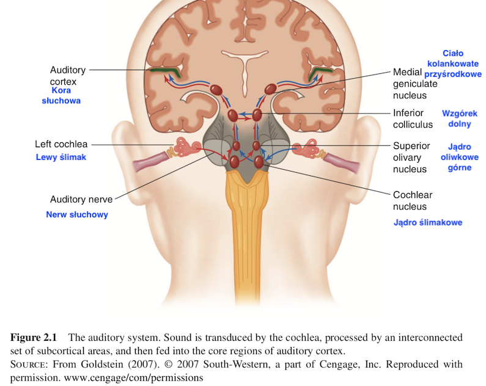

### Sound (Wikipedia)

- In physics, sound is a vibration that propagates as a typically audible mechanical wave of pressure and displacement, through a medium such as air or water.
- In physiology and psychology, sound is the reception of such waves and their perception by the brain.

---

### Acoustic waves

### Auditory scene

The game is this. Your friend digs two narrow channels up from the side of the lake. Each is a few feet long and a few inches wide and they are spaced a few feet apart. Halfway up each one, your friend stretches a handkerchief and fastens it to the side of the channel. As waves reach the side of the lake they travel up the channels and cause the two handkerchiefs to go into motion. 

---

### Your task

You are allowed to only look at the handkerchiefs and from their motions to answer a series of questions:

- How many boats are there on the lake and where are they?
- Which is the most powerful one?
- Which is the closest?
- Is the wind blowing?
- Has any large object been dropped suddenly into the lake?

### Bregman's analogy

This is a **strict analogy** to the problem faced by our auditory systems.

### Auditory system

