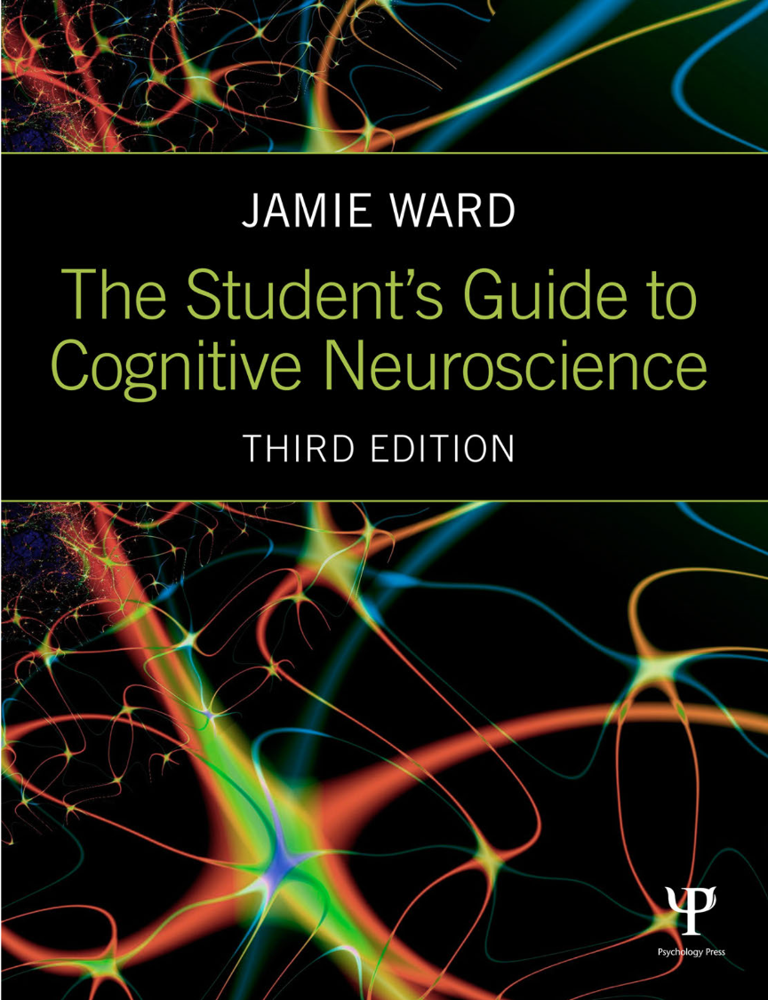
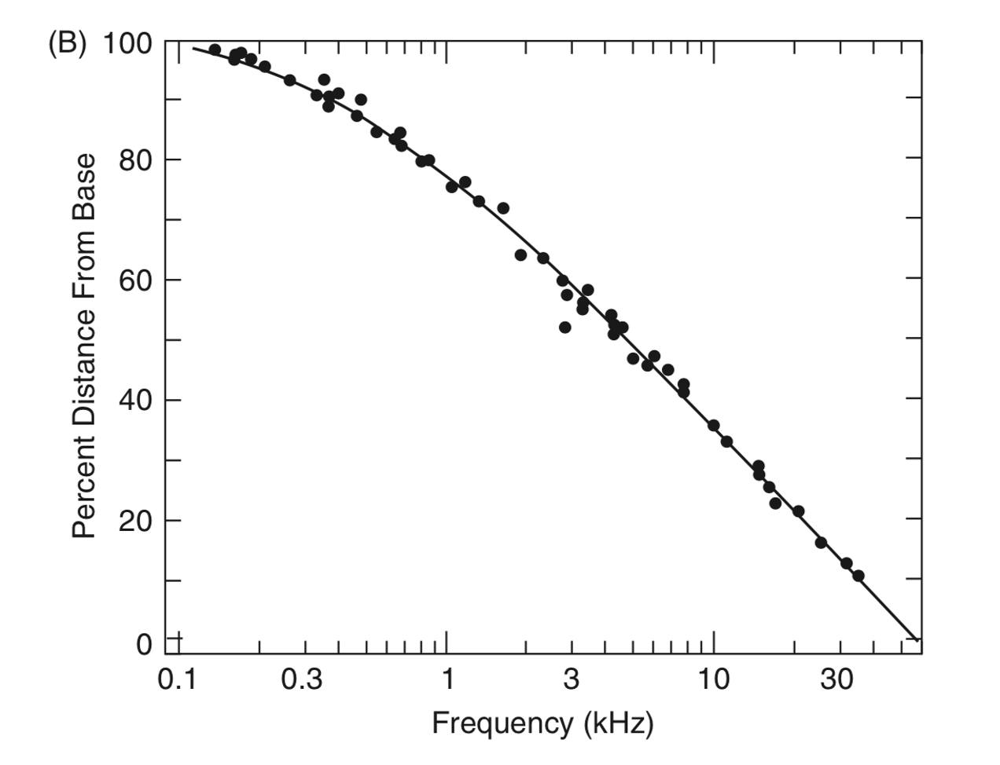
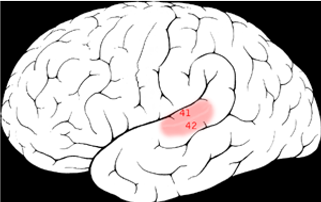
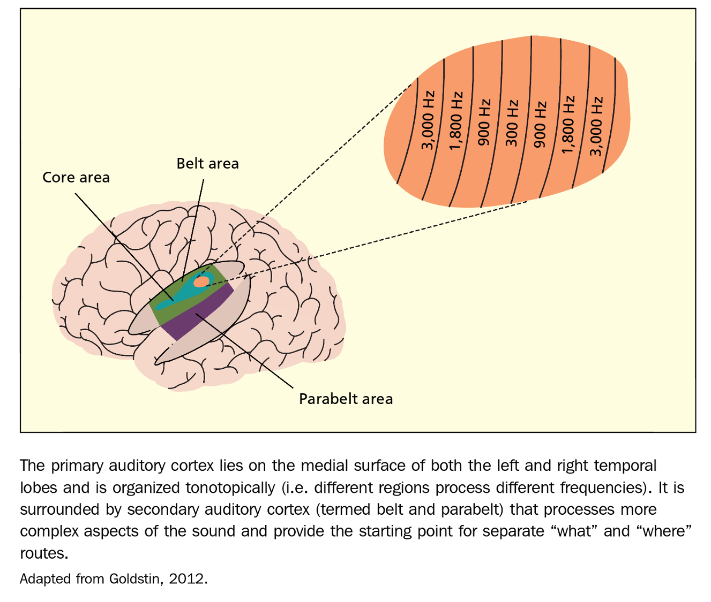
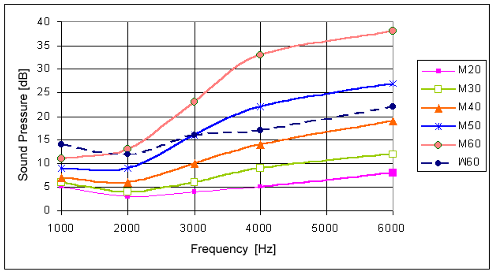

### What is sound?

Talk in groups (5 min.):

- What is sound from a **physical** perspective...
- ...from a **physiological** perspective...
- ... from a **psychological** perspective 

### Sound (Wikipedia)

- In physics, sound is a vibration that propagates as a typically audible mechanical wave of pressure and displacement, through a medium such as air or water.
- In physiology and psychology, sound is the reception of such waves and their perception by the brain.

### Acoustic waves

<https://www.sonicvisualiser.org/>

### Properties of waves

- Frequency
- Amplitude
- Speed of propagation
- What our ear percieves are changes in pressure over time

### Frequency

- Measured in Hertz (Hz)
- 1Hz = 1 oscillation per second
- Humans percieve frequency as **pitch** (low / high)
- Humans hear frequencies between 20Hz and 20,000Hz (20kHz)

### Amplitude

- Humans  percieve amplitude as **loudness**
- Physical measure of loudness – SPL (sound pressure level)
- Averaged SPL – RMS
- Logarythmic SPL – dB (decibel)

### Real-world sounds & amplitudes

| Sound | Distance | dB SPL |
|---|---|---|
|Stun Grenade |Ambient |158–172 | 
|Jet engine |1 m | 150 |
| Threshold of pain | At ear | 130-140 |
| Loudest Human voice | 1 inch | 135 |
| Trumpet| 0.5 m | 130
| Vuvuzela horn | 1 m | 120 |

### Real-world sounds & amplitudes

| Sound | Distance | dB SPL |
|---|---|---|
| Risk of instantaneous noise-induced hearing loss | At ear | 120 |
| Jet engine | 100 m | 120 |
| Traffic on a busy roadway | 10 m | 85 |
| Hearing damage (over long-term) | At ear | 85 |
| Passenger car | 10 m | 70 |

### Real-world sounds & amplitudes

| Sound | Distance | dB SPL |
|---|---|---|
| TV (set at home level) | 1 m | 60 |
| Normal conversation | 1 m | 40–60 |
| Very calm room | Ambient | 20–30 |
| Light leaf rustling, calm breathing | Ambient | 10 |
| Auditory threshold at 1 kHz | At ear | 0 |

### Speed of propagation

- Air, sea level, 20 degr. C. - 343 m/s
- Water: 1482 m/s
- Steel: 5960 m/s
- The speed of sound plays a crucial role in auditory perception of direction and acoustical environment detection

### Auditory scene

The game is this. Your friend digs two narrow channels up from the side of the lake. Each is a few feet long and a few inches wide and they are spaced a few feet apart. Halfway up each one, your friend stretches a handkerchief and fastens it to the side of the channel. As waves reach the side of the lake they travel up the channels and cause the two handkerchiefs to go into motion. 

---

### Your task

You are allowed to only look at the handkerchiefs and from their motions to answer a series of questions:

- How many boats are there on the lake and where are they?
- Which is the most powerful one?
- Which is the closest?
- Is the wind blowing?
- Has any large object been dropped suddenly into the lake?

### Bregman's analogy

This is a **strict analogy** to the problem faced by our auditory systems.

### Human auditory system

---

--- 

---

### Auditory pathway

### Auditory pathway

- Mostly bottom-up processing
- Rising complexity:
	- Cochlear nucleus – 90,000 neurons
	- Medial geniculate nucleus (in thalamus) – 500,000 neurons
	- Auditory cortex – 100,000,000 neurons
- There are top-down pathways as well, as far back as cochlea

### Frequency selectivity

- The cochlea is a bank of band-pass filters
- A combined output of these filters form the audible spectrum (20Hz-20kHz)
- This is called tonotopy
- The higher the frequency, the higher the band’s range

### Tonotopy

### Tonotopy

### Auditory cortex

--- 

### Auditory cortex

-  Primary auditory cortex (core) -> secondary auditory cortex (belt) -> secondary auditory cortex (parabelt)
- Tonotopy - tones close to each other in terms of frequency are represented in topologically neighbouring regions in the brain 
- Central regions in the core respond to lower frequencies, outer regions to higher frequencies

---

### Auditory cortex

- Neurons respond not only to specific frequencies but also to (single cell recordings in cats):
	- Changes in frequency (going up or down in pitch)
	- Transients (abrupt changes in intensity) (as in /p/ phoneme or other plosives)
	- Particular loudness levels (e.g. 30-50dB)
	- Particular location in space (e.g. only 20°- 30° to the right)
	- Combinations of loudness and location

### Auditory cortex

- Hierarchical organization – neurons in the core respond to narrow freqs (e.g. 200Hz) while neurons in the belt respond to wider frequency bands (e.g. 200Hz-300Hz)
- Perhaps belt neurons sum together activity from various core regions

### How sound is located

- Inter-aural time differences – sound arrives at one ear earlier that at the other
- Inter-aural intensity differences – sound at one ear is louder than at the other

### How sound is located

- Distortions by the head and pinnae – our heads and pinnae act as equalizers, changing the frequency spectrum of the sound
- This change is different depending on where the sound is coming from
- Our brains develop an internal model of how sounds get distorted – head-related transfer function
- We adapt to our own pinnae shapes – when the shape changes we have problems with locating sounds

---

### Loudness perception

### Age and gender differences

### Temporal summation

- Human hearing has evolved to be great at discerning sounds that are relatively long
- Very short sounds are perceived as quieter
- For example:
	- For sounds lasting 200ms auditory threshold is about 16dB
	- For sounds lasting 20ms the threshold is 26dB

### Auditory masking

