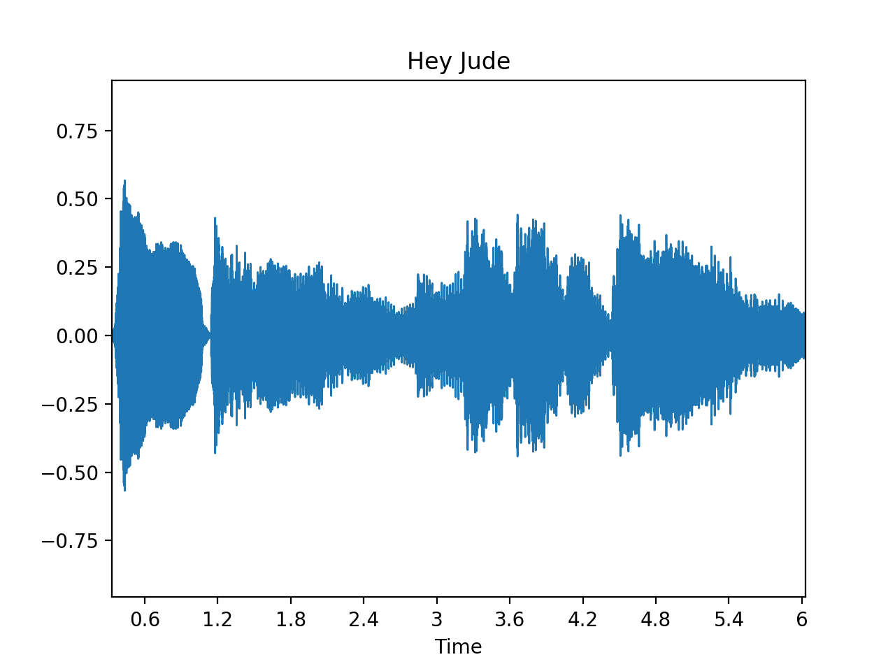
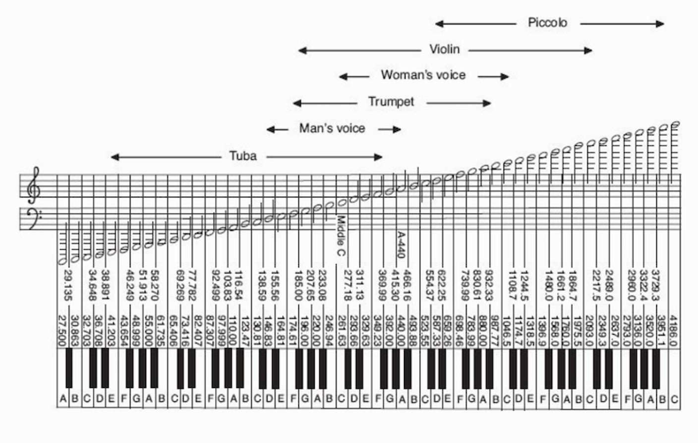

### What is music

- Work in groups (5 min.)
- Write an encyclopaedic definition of music

### What is music

<small>Art concerned with combining vocal or instrumental sounds for beauty of form or emotional expression, usually according to cultural standards of rhythm, melody, and, in most Western music, harmony. Both the simple folk song and the complex electronic composition belong to the same activity, music. Both are humanly engineered; both are conceptual and auditory, and these factors have been present in music of all styles and in all periods of history, throughout the world (Encyclopedia Britannica)</small>

### What is music

- Art form whose medium is sound (Wikipedia)

### The sound of music

--- 

<audio controls>
  <source src="audio/hey_jude/jude_original.mp3" type="audio/mpeg">
	Your browser does not support the audio element.
</audio>

---

<audio controls>
  <source src="audio/hey_jude/jude_original.mp3" type="audio/mpeg">
	Your browser does not support the audio element.
</audio>

### Key concepts

- Pitch
- Rhythm
- Tempo
- Timbre
- Loudness
- Melody
- Harmony

### Pitch

### Original

<audio controls>
  <source src="audio/hey_jude/jude_original.mp3" type="audio/mpeg">
	Your browser does not support the audio element.
</audio>

### Low pitch

<audio controls>
  <source src="audio/hey_jude/jude_low.mp3" type="audio/mpeg">
	Your browser does not support the audio element.
</audio>

### Sidenote: perfect pitch

- 1 in 10,000 people
- The ability to determine the pitch of a tone without a reference

### Sidenote: perfect pitch

- People with perfect pitch can:
	- Identify by name individual pitches (e.g. A, B, C♯) played on various instruments.
	- Name the key of a given piece of tonal music.
	- Reproduce a piece of tonal music in the correct key days after hearing it.
	- Identify and name all the tones of a given chord
	- Accurately sing a named pitch.
	- Name the pitches of common everyday sounds such as car horns and alarms.

### Rhythm & tempo

- In classical music – descriptive measures:
	- Largo, andante – slow
	- Moderato – moderately
	- Allegro – fast, happily
- In modern (especially electronic) music – BPM
- Meter:  4/4 (most pop music), 3/4 (waltz), 6/8, irregular meters – 7/8 (balkan, eastern music), 12/8 (blues shuffle)

### Original tempo

<audio controls>
  <source src="audio/hey_jude/jude_original.mp3" type="audio/mpeg">
	Your browser does not support the audio element.
</audio>

### Slower

<audio controls>
  <source src="audio/hey_jude/jude_slow.mp3" type="audio/mpeg">
	Your browser does not support the audio element.
</audio>

### Faster

<audio controls>
  <source src="audio/hey_jude/jude_fast.mp3" type="audio/mpeg">
	Your browser does not support the audio element.
</audio>

### Faster faster

<audio controls>
  <source src="audio/hey_jude/jude_fast_chip.mp3" type="audio/mpeg">
	Your browser does not support the audio element.
</audio>

### Melody

- Series of notes of different pitches, in certain rhythm
- Not absolute but relative differences between pitches constitute a melody

### Harmony

- A series of chords that usually back up a melody
- Chords are two or more notes sounding together

- Chords are characteristic of western tonal music, some types of music do not use chords per se (i.e. modern atonal classical music, some types of folklore)

### Original

<audio controls>
  <source src="audio/hey_jude/jude_original.mp3" type="audio/mpeg">
	Your browser does not support the audio element.
</audio>

### Minor key

<audio controls>
  <source src="audio/hey_jude/jude_minor_scale.mp3" type="audio/mpeg">
	Your browser does not support the audio element.
</audio>

### Timbre and room sound

### Original

<audio controls>
  <source src="audio/hey_jude/jude_original.mp3" type="audio/mpeg">
	Your browser does not support the audio element.
</audio>

### Bright timbre

<audio controls>
  <source src="audio/hey_jude/jude_highs.mp3" type="audio/mpeg">
	Your browser does not support the audio element.
</audio>

### Dark timbre

<audio controls>
  <source src="audio/hey_jude/jude_lows.mp3" type="audio/mpeg">
	Your browser does not support the audio element.
</audio>

### Reverberation

<audio controls>
  <source src="audio/hey_jude/jude_reverb.mp3" type="audio/mpeg">
	Your browser does not support the audio element.
</audio>

### Music is all around us

- It is universal to all cultures
- We spend a lot of our time listening to music
- We are surrounded by it (muzaks or elevator music)
- Most of us enjoy it (some don’t – amusia)
- It’s a business (third largest in the USA after energy and weapons)

### Amusia

- A defect in processing pitch, but it also encompasses musical memory and recognition.
- This leads to a loss of interest in music.
- Some people with amusia find music unpleasant or even distressing

### Amusia

- Two types:
	- Acquired amusia – a result of brain damage due to stroke, cancer, trauma, neurodegeneration
	- Congenital amusia – since early childhood, not a result of brain damage

### Amusia

- 4% of population are affected with congenital amusia
- Abnormalities in righ-hemisphere white and grey matter density in both auditory cortex and inferior frontal gyrus

### Why people listen to music?

- Work in groups (5 min.)
- Think of as many reasons as you can

### Why people listen to music?

- It provides pleasure
- Mood regulation (emotional management, stress)
- Distraction from boredom
- Social function – it brings people together (counter-cultures, national anthems)
- Evolutionary role?

### Evolutionary origin of music

- Bipedalism hypothesis – noise of human steps is the basic rhythm
- Audio-Visual Intimidating Display – music as form of intimidating an opponent
- Music as a form of mating behaviour (Darwin)
- Music increases social bonding

### Musilanguage

- Humans prefer music to silence, animals don’t (McDermott & Hauser, 2007)
- Musilanguage hypothesis – music as means of communication, evolved parallel to/before/after language

### Auditory cheesecake

_“Music is merely and auditory cheesecake. It just happens to tickle several important parts of the brain in a highly pleasurable way, as cheesecake tickles the palate.”_

Steven Pinker

### Music and emotion

### BRECVEM Model (Juslin & Västfjäll, 2008)

Seven ways in which music can produce emotion:

1. Brain stem reflex
1. Rhythmic entrainment
1. Evaluative conditioning
1. Emotional contagion
1. Visual imagery
1. Episodic memory
1. Musical expectancy

### Brain stem reflex

- One or more fundamental acoustical characteristics of the music are taken by the brain stem to signal a **potentially important and urgent event**
- Sounds that are sudden, loud, dissonant, or feature fast temporal patterns induce arousal or feelings of unpleasantness in listeners
- Such responses reflect the impact of auditory sensations – music as sound in the most basic sense

### Rhythmic entrainment

- Emotion is evoked by a piece of music because a powerful, external rhythm in the music influences some internal bodily rhythm of the listener (e.g. heart rate).
- The latter rhythm adjusts toward and eventually 'locks in' to a common periodicity

### Rhythmic entrainment

- The adjusted heart rate can then spread to other components of emotion such as feeling, through proprioceptive feedback
- This may produce an increased level of arousal in the listener.

### Evaluative conditioning

- Emotion is induced by music because this stimulus has been paired repeatedly with other positive or negative stimuli
- Music may have occurred repeatedly together in time with a specific event that always made you happy (e.g., meeting your best friend)
- Over time, through repeated pairings, the music will eventually come to evoke happiness even in the absence of the friendly interaction

### Emotional contagion

- Emotion is induced by a piece of music because the listener perceives the emotional expression of the music, and then “mimics” this expression internally
- This leads to an induction of the same emotion by means of either peripheral feedback from muscles, or a more direct activation of the relevant emotional representations in the brain. 

### Visual imagery

- Emotion is induced in a listener because he or she conjures up visual images (e.g., of a beautiful landscape) while listening to the music

### Episodic memory

- Emotion is induced in a listener because the music evokes a memory of a particular event in the listener’s life. This is sometimes referred to as the “_Darling, they are playing our tune_” phenomenon.

### Musical expectancy

- Emotion is induced in a listener because a specific feature of the music violates, delays, or confirms the listener’s expectations about the continuation of the music.

