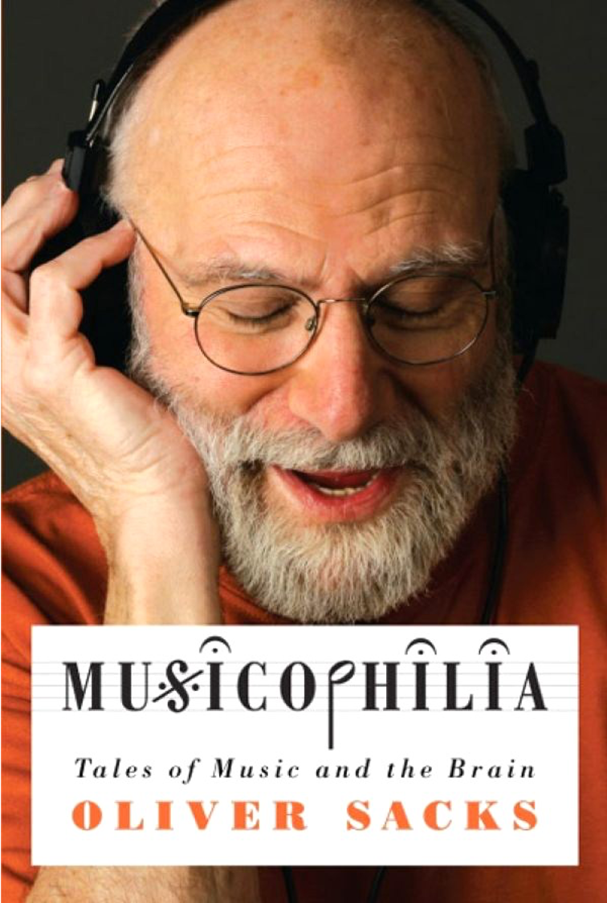

### Williams Syndrome

- Rare neurodevelopmental disorder – 1 in 7,500 to 20,000 births
- Genetic origin – deletion of more than 25 genes in the chromosome 7
- Symptoms:
	- Heart defects
	- Unusual facial features – ’elfin’ appearance
	- Developmental delay but strong language features
	- Failure to gain weight in infancy, low muscle tone

### Williams Syndrome - psychological symptoms

- Overall psychomotor development delayed
- Intelligence generally lower than average (IQ from 40 to 112, mean of 69, study of 306 children with WS)
- Intellectual deficits in visuospatial and motor skills (adults with WS often cannot complete a 6-piece children’s puzzle) 

### Williams Syndrome - psychological symptoms

- Higher anxiety levels, often developing phobias and other anxiety disorders (hypersensitivity)
- Comorbidity - ADHD

### Williams Syndrome - psychological symptoms

- Language skills delayed in semantics, morphology and phonology, but not vocabulary.
- Task: name animals. Child with WS: _“koala, saber-toothed cat, vulture, unicorn, sea lion, yak, ibex and brontosaurus”_
- Lack of social inhibition
- Often phenomenal musical abilities – perfect pitch, strong sense of rhythm, ability to produce polyrhythms without training

### Neurologic disorders and music functioning - case studies

### Tony Cicoria

- Small-town surgeon, 42 years old
- One day was hit by a lightning

### Tony Cicoria

_“…I got this wonderful feeling of calmness and peace. All the ups and downs in my life stood before my eyes, but no bad feelings, pure thinking and extasy. I felt sudden acceleration, a flight, there was momentum and direction... Most fantastic feeling that I’ve ever experianced...”_

### Tony Cicoria

- He suffered no major injuries
- A slight loss of energy and sluggishness in the first few days following the accident
- One day symptoms went away but…
- _“... I felt a sudden urge to listen to piano music...”_

### Tony Cicoria

- Dr Cicoria was never especially interested in music, never played an instrument
- After the accident, he experienced “obsessive thoughts about music”
- _“I got up as early as 4 a.m. and played the piano until it was time to go to work. When I got home, I played more, until it was time to go to bed. I was acting as if I was posessed”_

### Tony Cicoria

- He got divorced a couple of years later (his wife couldn’t handle it)
- A passion for music did not go away
- He took piano lessons
- Started to play concerts
- Found a new wife, a professional piano player

### What happened?

- Out-of-body experience has a neurological correlate – abnormal pattern of activity in the region between temporal and parietal lobes
- Mystical experiences, intense emotions – amygdala, brainstem nuclei
- These symptoms are often described in people who found themselves in extreme danger – sudden trauma, lightning, cardiac arrest
- Sudden, strong, noradrenaline secretion

### But why musicophilia?

- During the accident, dr Cicoria’s brain was probably in the state of hypoxia for about a minute – sluggishness, loss of energy
- Cortical damage was not diagnosed (1994, MRI was not that great then)
- It is possible that musicophilia is a result of functional plasticity due to cortical damage

### Jon S. – musical epilepsy

- Jon S., 45 years old, in good health until…
- One day got up from the desk to fetch something and heard music
- “...classical, melodic, very pleasant, strangely fammiliar...”
- Woke up in the hospital a few hours later
- During medical examination heard the same music again

### Jon S. – musical epilepsy

- What happened?
- Sudden temporal epilepsy – music as an aura

### Eric Markowitz – musical epilepsy

- A patient after operation – non-malignant tumor in the temporal lobe was removed
- The tumor relapsed after 10 years, this triggered epileptic seizures
- Did not loose consciousness during seizures, only experienced severe musical hallucinations
- The music seemed familiar, but could not be precisely described

### M.Critchley (1939) – epilepsy triggered by music

- Described 11 cases of seizures triggered by musical stimuli
- A radio operator on a ship had seizures when he heard brass instruments – needed to change to trade ships where there was no orchestra
- Other patient was sensitive only to the note G#

### The case of Nikonov

- Nikonov was a Russian music critic, late nineteenth century
- He first had an epileptic seizure during an opera performance
- The seizures became very frequent, triggered only by music
- He needed to change his profession and walked the streets of St.Petersburg with ear plugs.

### Poskanzer, Brown, Miller – case of Bow Church

- Male, 62 years old, was loosing cautiousness every day at 8.59 p.m. while listening to the radio.
- Epileptic seizures were triggered by the sound of the bells of Bow Church, a signal played each day on the BBC radio
- Patient was not sensitive to other sounds, not even other bells
- The seizures were produced by one, set sequence of sounds in a specific order
