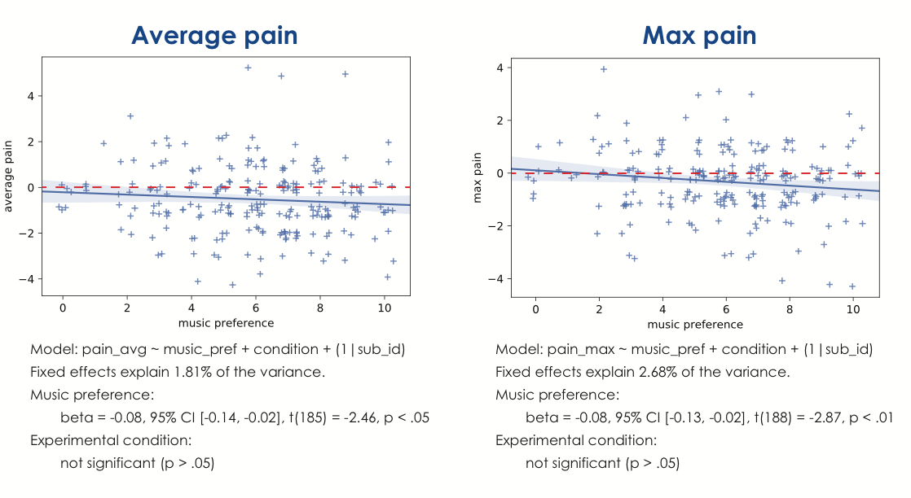

### Rational-Scientific Mediating Model

Bringing Evidence Based Medicine to music therapy

### Rational-Scientific Mediating Model (R-SMM)

- Uses basic and applied science to explain how music acts as a mediating stimulus to change behavior
- It proposes a framework to develop new music therapy techniques based on scientific evidence
- Main idea – scientific basis for music therapy stems from neurological, physiological and psychological foundations of music perception and production

### R-SMM – four steps

1. Musical response models: understanding of music behavior in question. This steps explain how humans perceive, produce or respond to music.
1. Nonmusical parallel models: a meaningful link between musical behavior and nonmusical behavior
3. Mediating models: exploration of influence of music on nonmusical behavior in typical and clinical populations
4. Clinical research models: clinical studies of treatment strategies

### R-SMM – example 1 (neurology)

Effect of rhythmic cueing on upper extremity movement in stroke patients

### R-SMM – example 1 (neurology) 

1. Rhythm perception – activation of basal ganglia, supplementary motor area, mid-premotor cortex, cerebellum
2. Regulation of motor control – activation of cerebellum, basal ganglia, motor and premotor cortex, parietal cortex – SIGINIFICANT OVERLAP

### R-SMM – example 1 (neurology) 

3. Exploration of immediate effect of rhythm on upper extremity movement in typical and clinical populations – rhythmic elbow movements increase kinematic stability in healthy controls and people with hemiparesis
4. Patients who recieved bilateral arm training with rhythmic auditory cueing (BATRAC) showed significant improvements in functional ability aof the paretic arm

### R-SMM – example 2 – vocal excercise and respiratory disease

1. Singing is basically pushing air through the vocal tract – larynx, throat and soft palate
2. Physiological structures involved in speaking are identical to that involved in singing

### R-SMM – example 2 – vocal excercise and respiratory disease

3. Mediating effect of singing – it requires greater respiratory effort than speaking. Therefore excercise in singing leads to better respiratory function and improved speaking
4. Clinical trials in patients with chronic obstructive pulmonary disease (Engen, 2005)

### Music-induced analgesia

Can music alleviate pain?

### Music-induced analgesia (MIA)

- „One good thing about music, when it hits you, you feel no pain” -Bob Marley
- Music has been used for pain relief for thousands of years (ancient Greece)
- There is experimental and clinical evidence that MIA works, but mechanisms are unclear

### Experimental evidence on MIA

- Lots of studies have been made with experimental pain stimulation while listening to music (and other stimuli).
- Three experimental studies compared preferred music (brought by participants) to relaxation music and white noise, to humour and mental arithmetic, and to visual distraction and silence. 
- In all of these studies preferred music had greater analgesic effect than other stimuli.

### Clinical evidence (metanalysis)

- Cepeda et al. (2006) reviewed 51 studies concerned with music-induced analgesia in a clinical setting. 
- They have found a considerable variation in the effects of music treatment. Subjects exposed to music had pain intensity significantly lower than controls.
- This effect was significant only in studies on postoperative pain.

### MIA - how could it work?

- Emotions:
	- When we feel good, pain threshold is higher and we feel less pain
	- Music can generate positive emotions

- Attention:
	- We feel less pain when we don’t think about it
	- Music can be a good distractor

### MIA - perspectives

- MIA is easily distributed, cheap and safe
- There are no known side effects
- More research is needed to determine percise mechanisms of MIA
- What kind of music is best for pain relief? We don’t know yet

### The problem of music preferences

- Music impacts different people differently
- Different people react differently to the same music – music preferences
- Music preferences have a multi-factor structure
- One theory that describes this structure is the AVD model (Greenberg et al., 2016)

### AVD (Greenberg et al., 2016)

- Music impacts different people differently
- Different people react differently to the same music – music preferences
- Music preferences have a multi-factor structure
- One theory that describes this structure is the AVD model (Greenberg et al., 2016)

---

### Method

- 4 experimental conditions: arousal, valence, depth, control (white noise)
- 2-minute compilations of 15-second music excerpts
- Participants say „how much did they like the music” on an 11-point Likert scale
- Experimental pain – cold pressor task - 3°C water for a max of 2 minutes

### Method

- Evaluation:
	- Pain threshold (sec)
	- Pain tolerance (sec)
	- Average pain intensity (NRS)
	- Maximal pain intensity (NRS)

### Method

### Results

---

---

---

